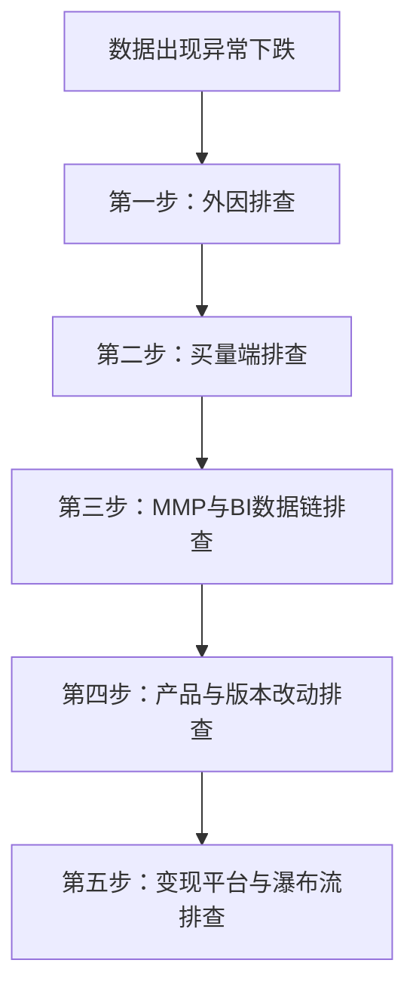

# ROAS 暴跌 / 数据异常五步排查法 SOP

当监测到核心指标（如 D1 ROAS、ARPDAU 或总营收）出现环比大幅下跌（如 >15%）时，须严格按以下递进链路依次排查：

---

## 排查链路与标准动作

---
### 第一步：外因排查（External Factors）
- **节日与大盘竞争**：检查是否处于海外重大节日（如黑五、圣诞、万圣节等），导致大盘竞价激增、CPM 整体拉高而挤压利润。

- **政策与平台变化**：检查 iOS / Android 官方政策调整（如 Privacy Manifest、ATT 弹窗逻辑变动、Google 开发者政策更新等）影响数据归因或广告渲染。

### 第二步：内因 — 买量端排查（User Acquisition）
- **买量计划状态**：检查主要投放渠道（Meta / Google Ads / TikTok）的 Campaign / AdSet 是否存在异常暂停、过审失败或预算限额。

- **素材合规与风险**：检查后台是否有素材违规警告、被限制展示（Disapproved / Limited）或版权问题。

- **花费与 CPM 波动**：检查消耗（Spend）是否存在断崖式下跌或突发飙升，评估是否存在素材疲劳（Frequency 过高导致 CTR 下滑）。

### 第三步：内因 — MMP 与 BI 数据链排查（Data Pipeline & Attribution）
- **归因平台（MMP）状态**：检查 AppsFlyer / Adjust / Firebase 是否存在 API 接口故障、归因逻辑异常或数据上报延迟。

- **内部 BI 展示校验**：对齐 MMP 原生后台数据与公司内部 BI 报表数据，排查是否因数据 ETL 抽取失败、打点丢失或看板计算逻辑 Bug 导致“伪数据下滑”。

### 第四步：内因 — 产品与版本改动排查（Product & Features）
- **广告位与交互调整**：排查最新版本是否调整了广告位展示逻辑（如插屏 CD 延长、开屏入口隐藏），导致 IPU（人均展示）下滑。

- **内购策略变更**：检查近期是否上线了新的定价策略、礼包档位调整或新手引导变更，导致首日付费率及 ARPPU 受到冲击。

- **埋点与打点逻辑**：检查最新版本 SDK 中的核心事件打点（Event Tracking）是否有漏传、重传或事件命名错误。

### 第五步：内因 — 变现平台与瀑布流排查（Monetization Platform & Waterfall）
- **变现平台状态**：检查聚合平台（AppLovin MAX / AdMob / LevelPlay）是否有数据延迟、API 服务异常或核减通知（Invalid Traffic）。

- **Waterfall 填充率与 eCPM**：排查瀑布流底价（Floor Price）设置是否过高导致大量流局，或 Bidding 竞价率出现异常下跌。
