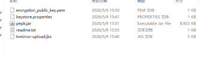

# 出海广告运营知识库

# 广告交易链

- 广告交易链条的核心玩家

|角色|俗称|职责|典型代表|
|---|---|---|---|
|Advertiser \(广告主\)|金主爸爸|想花钱投广告，推广自己的产品（比如另一个App、电商商品）。他们是钱的来源。|游戏公司 \(Supercell\), 电商品牌 \(SHEIN\), 应用开发商 \(TikTok\)|
|DSP \(Demand\-Side Platform\)|买手平台|服务于广告主。帮助广告主“智能地买广告位”。他们通过算法和数据，决定在哪个App、向哪个用户、以什么价格出价。|Google Ads, The Trade Desk, Mintegral, Liftoff|
|Ad Exchange|交易市场|连接买家和卖家的“证券交易所”。它提供一个公开的竞价平台，让来自无数DSP的出价在这里实时竞争。|Google AdX, Magnite, OpenX|
|SSP \(Supply\-Side Platform\)|管家平台|服务于开发者/发布商。帮助开发者/发布商“智能地卖广告位”，把广告位（库存）卖出最高价。|Google Ad Manager, AppLovin MAX的交易功能, Unity\&\#39;s SSP|
|Publisher|流量主/开发者|“场地老板”，负责开发和运营App，拥有海量用户和广告展示位（比如激励视频、插屏广告位）。|任何有广告变现的App开发者|
|Mediation Platform|聚合平台|优化师的主战场。它像一个“总包工头”，帮我们管理多个SSP/Ad Network，通过Bidding或Waterfall的方式，选出出价最高的广告来展示。|AppLovin MAX, ironSource \(Unity LevelPlay\), AdMob Mediation|
|Analytics \&amp; MMP|数据与监测方|负责追踪整个链条的数据，监测广告展示、点击、收入等表现，并提供ROI计算等服务，是精细化运营的眼睛|Adjust, AppsFlyer, Singular等|

---

- 从用户到广告主的完整竞价与展示流程图


**补充说明**

- **竞价成功**：ADX 通知胜出的 DSP，并返回对应的广告素材（或广告代码）给 SSP。SSP 再将广告素材送回开发者的 App 展示给用户。

- **用户交互**：用户看到广告，可能点击、下载、观看视频等。这些交互事件被上报给 DSP、ADX、SSP 及监测平台。

- **收入结算**：广告主按实际效果（展示、点击等）付费。资金流动：
**广告主 → DSP → ADX → SSP → 开发者**（各家抽取一定技术服务费）。

- **数据归因与优化**：
通过 MMP（移动监测伙伴，如 AppsFlyer）将广告交互数据与后续的用户价值（如留存、内购）关联，反馈给 DSP 调整出价策略，同时帮助 SSP 优化广告位配置。**形成买量 → 变现 → 再买量的闭环。**

---

- 在真实的出海开发场景中，开发者不会只用一个 SSP，而是使用 **聚合平台（Mediation）**（如 Max、Admob）。聚合平台的作用是：

    - 同时对接**多个 SSP、ADX、广告网络（AdMob 等）**。

    - 混合执行**实时竞价（Bidding）**和**瀑布流（Waterfall）**。

贴近实际操作的流程是：

**广告主 → DSP → ADX ← SSP（由聚合平台统一管理）← 开发者的 App**

---

# 买量

**一、 必备的底层知识体系**

作为 UA（User Acquisition，简称 UA/买量），不能只充当“建系列”的工具人，必须具备以下三大层面的知识：

1. 核心数据指标

- 成本/漏斗端： CPM（千次展示成本）、CPC（点击成本）、CPI（激活成本）、CPA（行为成本，如付费/注册）。

- 变现/价值端： LTV（生命周期价值）、ROI（投资回报率） / ROAS（广告支出回报率）。

    - 计算公式：ROAS = 广告带来的总营收/广告总花费

- 留存端： Retention Rate（次留、7留、30留），这是 LTV 的基石。

- 变现模式： IAA（广告变现）、IAP（内购变现）或混合变现。

2. 归因机制与数据追踪

- 掌握 MMP（第三方归因平台） 的工作原理（如 AppsFlyer, Adjust, Singular）。理解点击归因与展示归因的区别。

- 理解隐私政策对买量的冲击，如 iOS 的 SKAdNetwork \(SKAN\) 框架以及 Android 的 Privacy Sandbox。

3. 渠道算法逻辑

- 现代广告平台早已从“人工精细化出价”过渡到“机器学习/自动化投放”。UA 的核心工作是喂给算法正确的数据（信号），并准备高转化率的素材。

---

**二、 日常优化策略**

Google 和 Meta 是两大流量巨头，但它们的底层逻辑有本质区别。要提高 ROI，必须“因地制宜”：

1. Google Ads：调教算法与漏斗管理

1. Google 主要是 App Campaigns \(AC/UAC\)，高度依赖自动化机器学习。

    - 优化目标： \* 不要一开始就跑最高价值的动作（如购买）。如果数据量太少（每周少于 50\-100 个），算法无法学习。

1. 策略： 采用“沿漏斗上移”或“关键行为”优化。例如，先优化“完成新手教程”，积累足够数据后再切换到“应用内购买（IAP）”或“双向优化（ACe/ACi）”。

    - 素材多样性： Google AC 会在搜索、YouTube、Google Play 和 AdMob 展示。必须同时喂饱文字、精美图片（不同尺寸）、以及视频（横版、竖版、方形），缺少任何一种都会错失该版块的低价优质流量。

    - 价值出价（tROAS）： 如果是内购项目，当积累了足够的付费数据后，果断开启 tROAS（目标广告支出回报率） 出价，让 Google 直接去寻找愿意氪金的大推。

2. Meta \(Facebook\) Ads：素材驱动与受众破圈

2. Meta 是典型的“兴趣/信息流广告”，极其依赖素材去筛选受众（素材即定向）。

    - 素材是第一生产力： Meta 的受众很容易对同一组素材产生“审美疲劳”。提高 ROI 的最快方式是建立素材迭代流水线（每周测试新脚本、新前3秒 Hook、不同的 BGM）。

    - 利用 Advantage\+ App Campaigns \(A\+AC\)： 减少人工对受众的细分干扰。将相似受众和广泛受众交给 Meta 的 AI 去探索，给算法更大的空间。

    - 精确的事件回传： 通过 SDK 或 Conversions API \(CAPI\) 回传深层漏斗数据，确保 Meta 的像素能识别出高 ROI 用户的特征。

---

**三、 ROI 变差时如何排查与调整**

当发现 ROI 下跌时，切忌盲目乱改。必须遵循“从大到小、从外到内”的排查漏斗：

**诊断排查漏斗：**

```Plaintext
[大盘/外部因素] ➔ [产品/技术端] ➔ [广告渠道端] ➔ [素材端]
```

**第一步：定位根因**

|检查层级|排查痛点|对应动作|
|---|---|---|
|1\. 外部与大盘|是否遇到了节假日（如黑五、圣诞成本飙升）？是否有强劲竞品在大规模扫量？|观察整体大盘 CPM 走势。|
|2\. 技术与归因|SDK 是否漏传了付费数据？归因平台（MMP）是否挂了？|让数据分析师/技术核对后端实际总流水与广告后台回传流水是否对得上。|
|3\. 产品与变现|刚好更新了版本？新版本是否有严重 Bug 导致闪退？或者是变现策略（广告位、变现 Waterfall）被调整了？|检查各渠道的次日留存率。如果所有渠道留存同时暴跌，100% 是产品问题，而非买量问题。|
|4\. 广告渠道|哪些系列拖了后腿？是特定国家、特定版位（如 Audience Network）的 ROI 塌方？|进行数据切片分析。|

**第二步：具体调整对策**

如果确定是广告投放端的问题，根据 Google 和 Meta 的特性进行如下调整：

💡 场景 A：Google Ads ROI 变差

- 现象： 获客成本（CPI/CPA）飙升，导致 ROI 被拉低。

- 调整手段：

1. 降低出价（tCPA/tROAS）： 小步快跑式微调。每次降低 5%\-10% 的出价，逼迫算法去买更便宜的流量，但注意不要一次性调整超过 20%，否则可能导致系列直接“死掉”（跑不出预算）。

2. 清理低效素材： 检查 Google 后台素材评级（Low / Good / Best）。将评级为 "Low" 的素材替换掉。特别是 YouTube 视频，如果前 5 秒流失率极高，必须更换吸睛的开头。

3. 检查语言和国家： 如果一个系列包含了多个国家，算法可能会把预算倾斜到展示成本极低、但完全不付费的国家。解决办法： 将高价值国家（如美、日、韩）单独建系列隔离投放。

💡 场景 B：Meta Ads ROI 变差

- 现象： 广告跑着跑着，前几天 ROI 很好，突然从某天开始断崖式下跌。

- 调整手段：

1. 诊断素材疲劳： 检查 Frequency（频次） 指标。如果单用户看广告的频次超过 2\-3 次，且 CPM 上升、CTR下降，说明受众看腻了。

- 动作： 立即关停老素材，上线全新视觉风格或故事线的素材；或者扩大受众范围（Broad Target），稀释频次。

2. 检查广告组相互竞争： 自己账户内的不同 Campaign 是否在抢同一批受众？

- 动作： 使用 Meta 的“检查”工具查看拍卖重叠率。如果过高，合并广告组，减少内耗。

3. 版位优化： 检查 Meta 的 Audience Network（受众网络）或 Messenger 版位。很多时候这些版位有大量的误触点击（点击率高，但后续无转化）。如果发现其 ROI 极差，在非 A\+AC 系列中可以关闭 Audience Network 版位，只投 FB/IG 的 Feed 和 Stories。

---

# 买量素材类型

根据展现形式和心理驱动机制，素材主要分为以下几大类：

1. 展现形式分类

- 视频素材：绝对的流量主力。

    - 横屏 \(16:9\) / 方屏 \(1:1\)：主要用于 Google YouTube、AdMob 横版激励视频、Meta Feed 流。

    - 竖屏 \(9:16\)：流量增长最快，专攻 TikTok、Meta Reels/Stories、YouTube Shorts。

- 静态图片

- 主要用于 Meta 发现流、插屏广告或 Google Display Network \(GDN\)。虽然点击率通常不如视频，但在某些电商、工具或重度游戏（展示精美原画）中，转化率非常稳定，且制作成本低。

- 轮播/卡片

- Meta 的拿手好戏。一张广告展示多张可滑动的图片或视频，非常适合展示多款产品、功能矩阵、或者连环剧情故事。

- 可互动广告 / 试玩广告

- 主要用于游戏、社交和特定互动工具。让用户在不下载 App 的情况下直接在广告里“试玩”30秒，获取的用户意向极高，次留通常非常好，但制作技术门槛高（需要 HTML5 开发）。

2. 内容与心理机制分类

- UGC / 达人推荐风：看起来像普通用户拿手机自拍的开箱、评测、吐槽、使用前后对比。这种素材原生感强，用户警惕性低，在 Meta 和 TikTok 上 ROI 表现极佳。

- 痛点解决型：前 3 秒直接抛出用户最头疼的问题（如：“清理手机内存总是不足？”或“海外开会听不懂英文？”），随后给出你的 App 作为解决方案。

- 真人情景剧：制作有冲突感的小短剧（如：职场逆袭、情侣误会、老板刁难），在剧情高潮处植入产品功能。

- 玩法/功能展示：最直白地展示 App 最核心、最爽的那个功能界面。

---

# 素材监察与拉取网站

想要知道竞品在跑什么、什么素材效果好，可以从官方免费渠道和第三方付费 Spy 工具两个维度去抓取。

1. 官方免费 transparency（透明度）工具

为了应对反垄断和广告透明度要求，大平台都推出了官方的广告查询库。它们的优点是完全免费、数据 100% 真实，缺点是无法直接看到消耗数据或下载素材（需要插件辅助）。

- Meta Ad Library（Meta 广告档案库）

网址： facebook\.com/ads/library

用法： 必用工具。选择国家（或 Global），广告类别选择“所有广告”，然后直接搜索竞品的 Facebook Page 名字或行业关键词。你能看到他们当前正在线跑的所有广告素材、文案、上线时间以及投放了哪些平台（FB/IG/Messenger）。

高级技巧： 按照“开始投放日期”排序，找出那些已经跑了 2\-3 个月以上的“长寿素材”。在买量界，长寿等于盈利（不赚钱的素材早就被关了），这些就是你可以直接拆解和模仿的“爆款”。

- Google Ads Transparency Center（谷歌广告透明度中心）

网址： adstransparency\.google\.com

用法： 输入竞品公司的法定名称或网站，可以查到该广告主在 Google 搜索、YouTube、Display 展现网络上投放的文字、图片和视频素材。

- TikTok Creative Center（TikTok 创意中心 \- Top Ads）

网址： ads\.tiktok\.com/business/creativecenter

用法： 专门看短视频的风向标。可以按行业、国家、优化目标（如安装、留存、付费）筛选出表现最好的 Top 广告，甚至能看到视频的点击率（CTR）曲线和前三秒流失率。

2. 第三方专业 Spy 工具（移动端买量核心必备）

官方工具只能看“正在跑”的广告，而第三方工具经过技术抓取，能提供大盘排名、预估消耗、展示量、历史生命周期以及一键下载素材的功能。

- 广大大 \(SocialPeta\)： 国内出海圈用得最广的工具之一。对国内出海 App 和欧美、东南亚、日韩等市场的渠道覆盖极全，筛选功能强大，可以按 IAA（广告变现）或 IAP（内购）进行素材过滤。

- Data\.ai \(原 App Annie\) / Sensor Tower： 行业大厂标配。不仅能看竞品素材，最核心的是看竞品的买量下载量趋势、收入趋势以及主要买量渠道的占盘比。

- BigSpy / AdSpy： 偏向 e\-commerce（电商）以及独立自主查询的轻量级工具，拥有庞大的社交媒体广告数据库，价格相对综合平台更亲民。

- AppGrow： 专注于移动应用和游戏出海的素材大盘追踪，能够多维度分析竞品的投放策略。

---

# 拆解竞品素材

当你把竞品的素材拉下来后，不要生搬硬套，应该按以下结构进行像素级的拆解：

\[ Hook：前 3 秒怎么吸睛 \] ➔ \[ Body：中间如何展现产品痛点/爽点 \] ➔ \[ CTA：最后如何引导下载 \]

1. 拆 Hook（前 3 秒）：竞品是用真人出镜、惊悚音效、还是悬念文字把用户留住的？

2. 拆 核心价值：视频中段，他们强调的是“免费”、“快速”还是“解压”？

3. 做 差异化迭代：如果竞品的 UGC 吐槽风素材很爆，你可以复制它的核心脚本逻辑，但是更换前 3 秒的 Hook 视觉，或者换一个更具行动感（CTA）的结尾。

---

# 投放方式

***Google Ads***

1. AC 1\.0：最大化安装量，专注拉新，以最可能低的成本获取海量用户。

2. AC 2\.5：最大化应用内特定事件，不再以安装为最终目标，而是直接优化安装后的关键行为，如注册、通关。

3. AC 3\.0：最大化广告支出回报率 \(ROAS\)，以盈利为核心，致力于寻找能带来高额付费的高价值用户，实现投资回报目标。

4. 效果最大化广告（PMax）：它的逻辑是跨渠道（搜索、YouTube、展示等）自动分配预算，更偏向通用型智能投放。对于纯 App 买量，主流仍然以 AC 系列为主。

---

***Facebook***

1. 安装量 \(Installs\)：目标是以最低成本获取最多新用户，适合新品快速起量。

2. 应用事件优化 \(AEO\)：目标不是最大化安装量，而是让安装用户更大概率完成指定事件，比如“注册”、“添加到购物车”或“完成教学关卡”，追求用户深度。

3. 价值优化 \(VO\)：目标是最大化为App带来的总收入。系统会重点寻找那些未来可能产生高额付费（IAP）的用户。

4. Advantage\+ App Campaigns（简称A\+AC），它整合了上述所有优化目标，并将广告投放中繁琐的受众、版位、创意等环节，都交给了Meta的AI系统全权处理。

---

**调整Campaign带来的影响**


- **提高 tCPA**：这意味着你愿意为每次转化支付更高的成本。系统因此获得更大的竞价空间，它会去参与更多、更贵的竞价，以获取更多流量和转化。

    - 效果：曝光量和转化量通常会增加，但**单次转化成本（CPA）**也可能随之上升。

- **降低 tCPA**：这是“收紧钱袋子”的信号，系统会变得“保守”。

    - 效果：在最极端的情况下，会触发“CPA瓶颈效应”。当目标设置得低于市场平均水平时，系统判断无法达标，会直接放弃参与竞价，导致广告滞销、无法花钱、几乎没有转化，最终得不到任何学习数

- **提高 tROAS**：你向系统传达了追求“极致效率”的决心。

    - 效果：系统将只去竞拍那些它认为确定性最高的、能带来高回报的流量，这会导致广告曝光量和转化量被严重压缩。

    - 风险：这会触达“ROAS天花板效应”，导致广告消耗不掉预算，陷入“预算有，但花不出去”的困境。即便完成了ROAS目标，也可能是因为预算没花完，而不是因为你跑出了盈利模型。

- **降低 tROAS**：这是在向系统发出“以量换价”的“激进”扩张信号。

    - 效果：系统会放松对回报率的严格要求，去参加更多不确定的竞价，广告能获得更大的曝光量。

    - 可能的收益：虽然广告支出回报率（ROAS）可能会降低，但总收入和绝对利润总额反而可能增加。同时，更大的量和数据也能帮助系统进行更充分的学习和优化

---

# GooglePlay上架流程

1. 创建应用（名称、包名）

2. 创建证书（**更改key**时的步骤，如果gp后台的key和应用中的一致可以跳过，gp会自动提取）

    - 首先下载需要的文件（“Google Play Console”→“Production”→“Change signing key”→下载1、2两个文件）

    - 复制3的文本生成文本文档

    - 把两个key的文件和上述3个文件打包，然后发给开发（需求：\&\#34;生成一个GooglePlay的签名\&\#34;），得到一个压缩包

    - 在4上传压缩包




3. 创建GP项目

    1. "App content"

    - Foreground service permissions——如果有，需要上传功能的录屏链接（Youtube link）,special use需要有文字说明

    - Advertising ID——产品内有无广告，为什么使用广告


        - Health apps——是不是健康类产品

        - Financial features——是不是和金融金钱相关    

        - Government apps——是不是政府产品

        - Data safety——按照同类型产品填写即可   

        - Target audience and content——年龄限制   

        - Content ratings——填表单后系统判断

        - Ads——产品有没有广告

        - App access——产品内功能是否需要特殊权限

        - Privacy policy——填写隐私链接

        \* 如果涉及到\*\*前台服务\*\*需要提交视频链接，\*\*Special use\*\*还需要文字说明

    2. Store setting——填写应用类别，标签、邮箱、官网

    3. Store listings——应用名称，描述，图标，市场截图，应用类型，标签（上限5个）等

    4. Production——选择国家

4. 创建内购项目

    1. **“Subscription”**中新建，Name为后续需要填写的sku

    2. 如果有免费试用（Free trail）/首周优惠，需要增加一个offer，选择“New customer acquisition”→“Never had this subscription”→“Single payment”→选择优惠时长→选择价格类型（Fixed amount固定金额/Percentage discount百分比折扣/Absolute discount绝对折扣）

5. How to use link

6. FAQ link

7. Privacy policy link （同一个开发者账户下的应用可以共用一个link）

8. 版本发布（正式）

9. 上传App Bundle（\.aab）

10. 提交审核后若通过会自动发布

---

# AppleStore数据查询

- 查看当天的下载量（通述的安装数）：指标——左上角选择首次下载次数

趋势→销售→产品销量（默认状态下，不包含更新和以前购买的下载项目，可理解为首次下载）

- 用户订阅变动

    - 激活：新订阅周期的开始，包含首次订阅，免费试用开始，参与营销活动。

    - 取消：用户关闭自动续费。

    - 转为标准价格：从优惠价/试用期结束后转为正常付费。

    - 续期：指订阅在到期后成功扣款进入了新的周期。

    - 进入宽限期：指续期失败后的一小段“缓冲时间”，用户因为支付问题没能续费，但苹果暂时没取消，反而给了额外天数继续尝试扣款。

---

# 产品相关指标词汇

- North Star Metric（北极星指标）：能够反映产品的核心价值的单一指标，例如，微信，用户发出的第一条信息。Airbnb,用户预定成功的第一个间夜。

- Aha Moment（顿悟时刻）达成率：用户在多长时间完成了核心操作

- DAU/MAU （活跃度比值）：衡量产品粘性

---

# 内购优化

- 价格与礼包策略

    - 锚点定价：设置昂贵的礼包与高性价比礼包，昂贵的作为锚点。

    - 首充礼包/首冲翻倍：以极低的价格打破零付费的状态，复购概率会提升5\-10倍。

    - 捆绑销售：核心资源与稀有资源打包一起卖。

- 订阅制优化

    - 免费试用（Free Trial）使用转化率是优化点。技巧：结束前一天发push提醒/清晰标注“随时可以取消”，降低防备心。

    - 订阅周期对比

- 场景弹出与时机

    - 失败补偿/临门一脚

    - 限时折扣

- 商业化UI/UX优化

    - 支付流程简化

    - 商店红点与视觉引导“Best Value” or “Hot” 标签

- 用户分层动态定价

    - 购买力分层，大氪玩家推送高价值，高金额的稀有礼包；非付费/潜在付费玩家推送破冰礼包

    - 地区差异定价

---

# 账号相关问题

1. Facebook账户不能随便更换IP登陆，容易被封号

2. Admob账户付款信息填写示例：


3. 开设Admob新账户会遇到的问题：


4. Admob账户的注册地址不能更改。


5. 如果没有收到PIN码，需要三周后才能申请新的邮件。（PIN码是固定不变的）

身份验证排查工具：[https://support\.google\.com/admob/workflow/15180206](https://support.google.com/admob/workflow/15180206)
常见问题解答：[https://support\.google\.com/admob/answer/13030080](https://support.google.com/admob/answer/13030080)
AdMob PIN 码问题排查工具：[https://support\.google\.com/admob/workflow/10612601](https://support.google.com/admob/workflow/10612601)
常见问题解答：[https://support\.google\.com/admob/answer/3198657](https://support.google.com/admob/answer/3198657)

6. 申请新加坡身份证明，当地税务局需要google和广告主的合同，可以打印online terms of service，选择账号开设地区会自动生成合同，网址：[https://adsense\.google\.com/adsense/terms](https://adsense.google.com/adsense/terms)

7. 收入实时核减，Admob会随时对流量进行监测进行核减，不限于一天内，属于账单以外的核减。

8. 一个Gmail同时注册的GP和Admob账户，GP账号通过了实名认证和地址认证，但Admob收pin的地址没有收到pin，现阶段没有新地址可以修改，这种情况该怎么处理？

回答：如果是中国账号可以通过China EMS查询填写的地址，如果无人签收会退回到哪个邮局；如果是香港账号，可以询问HK post填写的地址如果无人签收会退回到哪个邮局。如果有了可以修改收信的地址，需要遵照Play改付款地址的流程更换新地址。建议开设新账户的时候可以避免和Play账号共用付款信息，方便以后出现需要修改的情况。

9. 香港账户实名认证，如果认证的次数过了，那么我们还有别的通道提交实名资料吗？

回答：身份验证问题排查工具：[https://support\.google\.com/admob/workflow/15180206](https://support.google.com/admob/workflow/15180206)

可以通过链接排查，是由于信息不清晰被拒绝还是资料本身有问题，前者会再给机会提交。

10. 请问公司注册地址修改以后，Admob和Play也需要更新修改吗？

回答：建议一起修改，如果Admob没有修改，在被抽查到的时候需要去解释原因，但是否接受解释不确定。

11. Payment更换了收款信息，触发了审核收不款，这个如何解决？

回答：更换收款信息可能会触发身份验证，如果账号处于暂停付款状态，就是遇到了随机抽查的状态，可以做的就是尽快提交验证资料。

12. 如果用不同的主体发行不同的应用，然后需要用不同主体名称的银行账号去收款，有没有什么解决方案

回答：Google规定上是不可以创建重复账号，但是如果是商业账号，Google判定是不是重复账号是要看每一个主体是可以创建一个Admob账号的，可以去连接该主体的收款方式，一个公司就是一个法人，就是一个主体，所以一个主体创建Admob是没有违规的。但是建议如果要这么做，需要使用不同的付款地址。如果是用同一个付款地址，创建了很多不同主体的账号，之后一个出了问题就有被关联的风险。

13. 在投放初期的过程中产品下架，或者出现开发者账户被封的情况，提示为开发者滥用政策

回答：了避免这种情况，开发者账户和产品还有Admob账户最好是独立的一套。

14. 同一个开发者账户，使用两个Admob账户去运营，会不会因为使用同一个play被关联？

回答：对于政策中心来说主要看产品的表现。如果说产品在政策中心已经有违规提示，不管有关联几个Admob账号，都会在政策中心有报错；如果说是无效流量报错，在关联的两个admob账户中，主要变现的还是这个产品，那两个账户会比较危险。

15. Admob封号不影响收验证码（验证码是邮件），封号之后会有很大可能要去回溯过去60天的表现去扣款，扣款可能会扣成负数。假设彻底被封号，没有办法进到UI界面，可以在google pay中找到payment console，可以看到账单明细，看能否收款。

16. Admob新账户收款账户的银行卡收款人名称，必须要和身份验证的姓名一样吗？

回答：推荐最好一样。

17. Policy center里面一个应用以前的版本限制了广告，怎么样才能从Policy center里面移除，已经更新了很多新版本，之前限制广告的版本已经没人下载，也没有请求了，但是Policy center里面的警告一直存在。

回答：7天内旧版本中没有广告请求的时候，警告就会解除；如果说大部分的用户已经在新版本中，那对账户的影响也不大

18. Admob注册的时候用香港公司注册，身份验证如果用中国的，那地址验证的地址是和公司一致还是和验证人一致呢

回答：如果是公司账号，要看注册地在哪，香港公司注册那验证应该是在香港，如果是身份验证是国内可能会不过。

19. 我们是做游戏研发，早期是代理给外部公司发行，Admob用的是发行的，现在产品回收，打算换成我们自己的Admob，这样也会有影响吗

回答：确认发行的Admob账户中没有请求之后，就可以更换成自己的Admob，移除ads\.txt中发行账户的代码，不会有影响。

20. 对于发行公司来说，他们会接很多外部代理产品，用的都是自己的Admob账号，有些产品后期会因为违规下架，这对Admob账号会有影响吗？如果admob也及时删除这个下架产品的所创建广告ID呢？

回答：违规下架不会对本账户造成太大影响，如果要在新账户上架可能会有关联风险；广告位ID无法删除，只能等id没有请求。

---

# AdMob 聚合Waterfall调优流程

一、 数据准备与前置漏斗

- **数据周期：** 可以参考近 3 日（含当日），如果近三天的用户增长有较大波动，可以增加参考近7天内用户增长稳定时期的数据。

- **核心指标：** Bidding/Network 的实际 eCPM、填充率 \(Match Rate\)、点击率 \(CTR\)。

- **低权指标：** 当日展示率 \(Show Rate\) —— 因数据延迟，仅作辅助，不作决策依据。

- **低权重指标**：当日的展示率（Show Rate）。由于数据回传延迟或未跑完，当日展示率极不准确，不占太多参考比重。

---

二、 核心场景调优矩阵 \(基于 Bidding 联动\)

|场景分类|核心表现|调优动作与逻辑|
|---|---|---|
|情况 A|Bidding eCPM **持续下降**<br>部分瀑布流填充率**升高**|**保守观察**：调优不宜过于激进，**避免大幅上调**瀑布流出价，以防进一步拉低整体收益（ARPU/Revenue）。|
|情况 B|Bidding eCPM **表现稳定**<br>部分瀑布流填充率**升高或降低**|**顺势微调**：依据填充率的变化，对瀑布流出价进行**相应的上调或下调**，核心目的是维持填充率与 eCPM 的动态平衡。|
|情况 C|Bidding eCPM **持续升高**<br>部分瀑布流填充率**降低**|**积极争取**：参考当前 Bidding 高时的 eCPM 水平，**适当上调**瀑布流出价，卡住优质区间，争取更高价值的广告展示。|

---

三、 增/删/调层级的“量化阈值”

1. 明显变化的判定标尺 \(近 3 日\)

- 个位数填充率： 涨跌幅 $\ge 2\%$ 视为明显变化。

- 两位数填充率： 涨跌幅 $\ge 5\%$ 视为明显变化。

2. 调优、加层与缩减逻辑

- 调某一层**：**近3日填充率稳定且\>3%时，尽量保持不动，避免打乱机器算法。

- 加层阈值：

    - 前提条件：当前最高层的填充率\>15%且 Match 请求数\>200（确保上浮后仍有基本盘）。

    - 定价策略：

        - 参考 AdMob 后台 Bid Landscape report 查看 eCPM 分布，避免盲目出高价压制 Bidding 导致整体 eCPM 下滑。

        - 常规最高出价天花板为 Bidding eCPM 的 1\.5 \~ 2 倍。

        - 经典三层结构：Bidding 以下出一层→贴着 Bidding 往上出一层→1\.5 倍高位出一层。

- 减层熔断：

    - 硬性地平线： AdMob 瀑布流层填充率\<3%，或三方 HB/瀑布流层填充率\<1%（或收入贡献极低），直接砍掉。

    - Bidding 压制熔断： 若 Bidding 展示数已萎缩至 200\~300 左右，必须果断精简瀑布流层级，避免层级过多影响广告响应速度并干扰 Bidding 机器学习。

    - 噪音过滤： 填充率虽在 5%\~10%，但展示数\<100，或 3 日内涨跌幅在±1%内微幅震荡的，均不作调整（视为随机波动）。

- 常规微幅震荡：AdMob 瀑布流在 3 日内出现“先涨后跌”，但整体涨跌幅度都在 1% 左右。此情况属于正常数据大盘内波动，不做调整。

---

四、 异常极端情况排查与归因

当遇到原本填充率很高，突然在两天内暴跌至 0\.x% 的断崖式下跌时，执行以下双通路排查：

诊断一：买量/用户增长突增

- 现象表现：填充率暴跌，同时伴随着 AdMob Bidding eCPM 的同步上涨。

- 背后逻辑：由于短时间内涌入大量新用户/低价值变现流量，大盘请求量剧增。现有的瀑布流出价对于这批新流量来说偏低，导致卡不上位置。

- 应对措施：根据当前最新的 AdMob Bidding 实际 eCPM 重新计算并上调出价，重新咬合流量。

诊断二：用户流量周期性波动

- 现象表现：填充率暴跌，但瀑布流层的实际 eCPM 与填充稳定时基本持平。

- 背后逻辑：属于受假期、周末或产品自身流量周期影响的规律性下降，广告位整体变现价值未发生本质质变。

- 应对措施：无需恐慌，直接根据该层处于稳定时期的填充率，进行常规的上下微调出价即可。

不过不同的产品会有不同的规律（同品类可以用同样的出价思路），新产品的ecpm有时怎么也填不上，可以暂时不做调整，让它自己学习一段时间再调整。

---

# 产品运营拓展

**一、 深入理解用户 \(从“流量”到“活生生的人”\)**

核心工作是变现，但变现的对象是用户。不理解用户，你的优化永远停留在“术”的层面。

1. **用户生命周期管理:**

新用户期： 新用户进来后，TA的体验是什么？过早、过强的广告是否会吓跑他们？是否应该在新用户保护期减少广告强度，优先让他们体验核心玩法，培养留存？

成长期：用户在哪个环节会停留最久？哪些功能使用最频繁？这些地方是不是增加激励视频广告的好机会？

成熟/付费期 ：对于已经付费的用户，广告策略是否应该有差异？（例如，减少干扰性广告，提供更多“免广告”特权）。

流失期：用户流失的关键节点在哪？是不是因为广告太多、太烦？分析流失用户的广告曝光数据，能找到很多优化点。

2. **用户分层与行为分析:**

分层维度：除了付费/非付费，还可以按活跃度、游戏进度、国家地区、来源渠道等进行分层。不同用户群体的广告承受能力和偏好是完全不同的。

行为分析：用户为什么会点击这个激励视频？是为了复活、获取道具还是解锁关卡？理解“动机”能帮你和产品经理一起设计出eCPM更高、对用户体验伤害更小的广告场景。

3. **用户体验与反馈:**

广告对UX的影响：主动关注App Store、Google Play、社区的用户评论。当用户抱怨“广告太多”、“广告卡顿”、“广告恶心”时，要第一时间定位问题，并思考解决方案。

A/B测试的UX思维：在设计广告A/B测试时，除了看广告收入，必须关注对核心数据的影响，如次日留存、7日留存、人均session时长等。收入的短期提升如果牺牲了长期留存，是得不偿失的。

---

**二、 打通增长全链路 \(从“回收”到“闭环”\)**

广告变现不是孤立的，它是整个用户增长飞轮的最后一环，也是最重要的一环。

1. **用户获取 :**

理解核心指标： 学习CPI 、LTV 、ROAS 等买量核心指标。

建立LTV \> CPI的思维： 你的工作是最大化LTV。你要能清晰地告诉UA同学：“我们产品来自Facebook渠道、美国地区的iOS用户，预估7日LTV是𝑋，你们可𝐶𝑃𝐼出价顶到Y”。这是打通增长“任督二脉”的关键。

渠道质量分析： 不同渠道买来的用户，其行为和变现价值差异巨大。你需要和UA团队一起分析，哪些渠道的用户LTV更高，从而指导他们优化投放策略。

2. **产品核心数据:**

留存率 : 这是所有产品的基础。高留存意味着用户生命周期长，你能从单个用户身上获得的广告展示次数就更多，LTV自然更高。

活跃数据 \(DAU/MAU\): 活跃用户是变现的基础。你要关注DAU的波动，并能将其与你的广告策略变动关联起来分析。

参与度 : 如人均使用时长、session次数等。这些数据直接影响广告展示的频次和场景数量。

---

**三、 夯实产品运营功底 \(从“调价”到“设计”\)**

与其被动接受产品设计的广告位，不如主动参与进去，从源头提升变现效率。

1. **A/B测试科学方法论：**

不仅懂瀑布流的A/B Test，更要懂产品功能的A/B Test。比如，一个新功能上线后，对整体广告收入有什么影响？是对核心用户群广告收入产生正向影响还是负向影响？

学习假设驱动、变量控制、数据显著性等科学测试知识。

2. **竞品分析：**

定期体验和拆解市面上成功的竞品，特别是他们的广告设计。

要分析什么？ 他们的广告位在哪里？广告频次如何？激励视频给的奖励是什么？用了哪些广告平台？他们的IAP（内购）和IAA（广告变现）是如何平衡的？

---

**四、 提升数据硬实力 \(从“看报表”到“挖洞察”\)**

你已经具备数据分析基础，但可以更进一步。

1. **工具掌握：**

SQL： 强烈建议学习！能让你摆脱对数据分析师的依赖，自主进行更深度的用户行为查询和归因分析。比如，你可以自己跑数据看“连续三天点击激励视频的用户，他们的30日留存率和付费转化率有什么变化”。

数据可视化工具 \(Tableau, Power BI等\): 学会用这些工具，能让你更好地呈现你的数据发现，更有说服力地推动产品和运营团队采纳你的建议。

2. **数据建模思维：**

LTV预测模型： 了解LTV预测的基本逻辑和方法，哪怕你不会亲自建模，也能更好地理解和使用公司数据团队产出的LTV数据。

用户分群模型 \(RFM等\): 学习一些基础的用户分群模型，能帮你更科学地进行用户分层运营。

---

# PRD文档

一、PRD的目的

- 对齐“做什么、为什么、做到什么程度算成功、怎么验收、什么时候交付”

- 让研发、设计、测试、运营、法务、市场在同一版本下协同落地

- 可作为发布和复盘的依据

二、文档形态

- 0\-1产品长PRD：问题定义 \+ 商业目标 \+ MVP范围 \+ 路线图

- 迭代/单功能精简PRD（One\-pager）：目标 \+ 方案 \+ 验收 \+ 影响面 \+ 里程碑

三、标准PRD模板（可复制）

1. 概要与背景（Why）

- 业务背景：当前问题/机会、竞品与洞察（简要数据支撑）

- 目标用户与核心场景（JTBD）

- 北极星指标与本次关键目标（SMART）

2. 范围与非目标（Scope）

- 本期要解决的问题与场景

- 明确本期不做（Non\-goals），避免范围蔓延

- 优先级（MoSCoW：Must/Should/Could/Won’t）

3. 成功指标与保护性指标

- Primary KPI（如新客转化率、Day1留存）

- Secondary/Guardrail（崩溃率、加载时长、退款率）

- 目标值与数据口径（埋点/表名/字段）

4. 用户故事与用例

- 用户故事：作为\[用户类型\]，我想要\[动机\]，以便\[价值\]

- 关键用例与异常用例（含未登录、网络差、权限拒绝、空态）

5. 功能需求（可测试、无二义性）

- 功能点1：描述

    - 交互规则与业务规则（含边界/例外）

    - 验收标准（Given\-When\-Then）

- 功能点2：…

- 状态与错误码策略（前后端一致）

6. 交互与信息架构

- 用户流程图（入口\-操作\-完成/失败）

- 页面清单与关键线框稿（链接到Figma）

- 各状态：加载、空态、错误、成功、占位、引导

7. 数据与接口

- 数据模型/字段定义（类型、枚举、默认值、约束）

- API契约（方法、参数、返回、错误码、速率限制）

- 埋点方案（事件名、触发时机、属性、用户ID策略、去重规则）

8. 规则/算法（如适用）

- 排序/推荐/风控规则、离线/实时、A/B可配置项

9. 非功能性需求（NFR）

- 性能：TTI、冷启动、P95接口时延、包体大小

- 兼容：iOS/Android最低版本、机型适配、深色模式

- 稳定性：崩溃率阈值、重试与回退机制

- 安全与隐私：加密、权限最小化、数据留存周期、日志脱敏

- 可用性与无障碍：可触达尺寸、语义标签、读屏、对比度

- 国际化与本地化（出海重点）：多语言、时区、货币、数字/地址/姓名格式、RTL

- 合规：GDPR/CCPA、COPPA、iOS ATT、Play Data Safety、隐私营养标签

10. 依赖与资源

- 跨团队/第三方SDK/法务/采购依赖，负责人与到位时间

- 实验平台、推送、支付、风控、CDN等

11. 风险、假设与权衡

- 关键假设与验证路径

- 主要风险、影响、缓解方案

- 开放问题与决策截止时间

12. 里程碑与发布计划

- 时间线：需求评审/设计走查/技术评审/开发/联调/测试/灰度/全量

- 灰度策略、回滚预案、版本标记

- App上架准备：截图、文案、关键词、隐私表单、合规审核要点

13. 运营与增长策略

- 激活与教育：新手引导、空态文案、推送/邮件

- 定价与促销（如有付费）

- FAQ与客服预案、监控与报警

14. 实验与验证

- A/B实验设计：假设、样本量、指标、最短运行周期、止损/晋级条件

- 埋点验收清单与数据核对方式

15. 附件与变更记录

- 相关文档链接（市场调研、原型、数据报表）

- Changelog（版本号/日期/修改人/要点）

四、精简PRD（One\-pager）示例

- 背景：新用户注册转化低（28%），主要流失在验证码与密码设置

- 目标：注册转化\+8pp（28%→36%），不劣化崩溃率与TTI

- 方案摘要：支持Apple/Google一键登录；短信改图形验证码备选；密码设为可见切换

- 关键需求：

    - 三方登录：支持取消回退、错误提示；账号合并策略

    - 短信表单：国家码自适应、冷却60s、多语言文案

- 验收指标：新客注册转化≥36%，崩溃率≤0\.3%，登陆平均耗时≤2\.5s

- 风险：旧账号冲突；三方回调失败；某些市场三方服务受限

- 里程碑：设计3天、开发8天、QA3天、灰度7天

- 埋点：login\_click、login\_success、error\_type、provider

五、详细功能验收示例（Given\-When\-Then）

- 功能：Google 登录

    - Given 用户在登录页且设备已安装GMS

    - When 点击“Continue with Google”并选择账号

    - Then 首次登录完成自动创建账户并进入首页；埋点login\_success\(provider=google\)

    - 异常：网络错误弹出重试；用户取消回到登录页，无Toast干扰；错误码auth\_4xx统一文案

- 账号合并规则

    - Given 同邮箱存在密码账户

    - When 用户用Google登录

    - Then 弹出合并提示；确认后绑定并以后优先三方登录；拒绝则返回登录页

六、出海App的PRD要点（容易忽略）

- 本地化与合规

    - 多语言资源规范与上线流程（翻译占位、文本长度溢出）

    - 货币/时间/地址/姓名顺序、电话号码格式与校验

    - GDPR/CCPA 同意与撤回、数据删除自助流程、跨境数据声明

    - iOS ATT弹窗时机与文案、本地化的隐私政策与服务条款

    - App Store/Play Data Safety表单、付费合规（虚拟商品走IAP）

- 上架与素材

    - 分市场素材与关键词、定价分级、税/VAT设置

    - 审核要点：登录方式、第三方内容、用户生成内容的申诉与举报

- 技术与体验

    - 弱网与高时延市场优化、本地缓存与CDN

    - 设备碎片化适配、包体分拆（Android App Bundle）

    - 无障碍与RTL支持、深色模式、本地法规的年龄分级

七、写作与协作建议

- 面向“读者”写：避免只写意图，要写清“可测试的结果”

- 用数据界定问题与目标，承诺可量化的成功标准

- 规则先于界面：先写业务/边界/异常，再配线框

- 减少二义性：枚举边界值、错误码、空态/权限/离线

- 持续更新：版本号与变更记录；需求、设计、接口三方评审

- 需求映射到交付：PRD功能点→Jira Epic/Story，避免遗漏

- 提前合规与安全评审，第三方SDK清单与开源License

八、PRD检查清单（发布前逐项确认）

- 目标与KPI清晰且可被埋点验证

- 非目标与范围边界已声明

- 异常/空态/权限/离线/错误码覆盖

- 国际化、隐私、合规与商店要求已确认

- API契约、数据模型、埋点方案已评审

- NFR（性能/稳定/包体/兼容/可用性/无障碍）有指标

- 灰度与回滚策略明确，监控告警配置就绪

- 上架素材与合规表单准备完成

- 客服FAQ与日志排障入口可用

---

# 广告竞价流程


---

**Step 1：用户触发广告位**

用户在手机上打开了一款 App（比如一款休闲游戏），或者玩完一局准备进入下一关。此时，App 的程序代码触发了广告逻辑（例如：准备展示一个激励视频或插屏广告）。

**Step 2：App 端向聚合服务器发起请求**

App 内集成的聚合 SDK（Mediation SDK）在零点几毫秒内收集当前设备和用户的基本“画像”信息（这些统称为设备上下文），并向聚合平台的云端服务器打包发送请求：

> 📋 **请求中包含的数据：**

- **广告位信息：** 广告位 ID（Ad Unit ID）、广告类型（激励视频/横幅/插屏）、期望尺寸。

- **设备与环境：** 操作系统（iOS/Android）、设备型号、网络类型（5G/Wi\-Fi）、运营商、国家与语言。

- **合规与隐私：** 隐私授权状态、ATT 状态（iOS 是否允许追踪）、设备广告标识符（如 Android 的 GAID，若用户授权）。

**Step 3：聚合平台组织竞价**

聚合平台收到请求后，立刻向所有对接的广告源（Ad Sources）群发这一条“求购信息”。在这个瞬间，流量被分发到两条赛道：

- **Bidding 渠道（实时竞价）：** 聚合通过实时响应协议（如 OpenRTB），同时向 Meta Audience Network、Mintegral、Liftoff 等实时竞价者（Bidders）广播，要求他们在 100\~300毫秒内 给出报价。

- **Waterfall 渠道（传统瀑布流）：** 针对那些不支持实时竞价、或者依然配置了固定价格（Floor Price）的传统网络，聚合会准备一个按历史价格从高到低排列的队列。

**Step 4：广告渠道的算法疯狂计算、并实时出价**

每一个收到请求的广告渠道（DSP/买量平台），他们的服务器和算法开始以微秒级的速度运转。

1. **受众匹配：** 渠道算法查看设备信息：“这是一个位于美国的 iOS 用户，正在玩解谜游戏。” 算法在其数据库里匹配，发现你（买量方）刚好在投这类受众。

2. **CTR/CVR 预估：** 算法评估：如果把你的素材展示给这个用户，预估点击率（pCTR）和预估转化率（pCVR）是多少？

3. **最终出价（eCPM）：** 结合你的出价和预估概率，平台算法计算出这单次展示的最终出价（比如 $18\.50 ）。然后，渠道将出价金额和广告素材代码（Creative HTML/Video URL）一并回传给聚合。

**Step 5：传统 Waterfall 渠道响应**

与此同时，聚合查看 Waterfall 队列里此时排在最前面的层级（比如有个固定底价为 $15\.00 的广告源）。如果该渠道有填充（即有广告可以出），它会响应“我有货，价格是 $15\.00”。

**Step 6：聚合裁判判定赢家**

聚合 SDK 或服务器在规定的截止时间内截止收单。它把收到的所有实时竞价报价与传统 Waterfall 的最高有效价放在同一个竞技场里对比。

- *渠道 A \(Bidding\): $12\.00*

- *渠道 B \(Bidding\): $18\.50*

- *渠道 C \(Waterfall 层\): $15\.00*

**裁判宣布：**渠道 B 以 $18\.50 绝对优势赢得本次展示机会。（现在行业已基本普及“第一价格拍卖（First\-Price Auction）”，即赢家出多少就付多少，从而保证卖方利益最大化）。

**Step 7：广告渲染与曝光**

聚合 SDK 批准渠道 B 的素材入场。 App 端收到赢家的素材链接后，立刻开始下载、缓存并播放视频（或渲染图片）。当广告的第一帧在用户手机屏幕上成功显示出来时，SDK 触发Impression事件。

**Step 8：数据结算与计费回传**

- **计费：** 广告平台（渠道 B）在收到曝光回调后，正式从你（买量广告主）的账户里扣除本次竞价折算后的广告费。

- **变现结算：** 聚合平台记录下该 App 赚到了这笔钱（IAA 变现）。

- **追踪：** 如果用户被广告吸引并点击了广告，则触发 Click（点击），用户的设备会被重定向到 App Store/Google Play 落地页；MMP（第三方归因）开始记录点击信号，等待用户下载后进行归因。

---

测试中可能会遇到的问题

|广告平台|调试难点 / 无法测试的表现|主要原因|建议对策|
|---|---|---|---|
|Meta|频繁出现 `No Fill`（无填充）或 `Error 1001`|对测试账号有极高要求，必须在真机上登录 Facebook 账号且该账号需在 Business 开发者名单中。|确保真机安装了 Facebook App 并登录；在后台录入设备的 IDFA/AAID。|
|Pangle|模拟器完全不填充，真机加载极慢|严禁模拟器调试，且对网络环境（IP 地址）与广告位 ID 的匹配度要求极严。|必须使用真机调试；检查 IP 是否属于广告位目标国家；在后台手动添加测试设备。|
|AdMob|调试模式配置不当会导致加载“真实广告”|AdMob 保护机制严密，若未正确注册 `Test Device`，容易因误点真实广告导致账号被封。|使用 AdMob 提供的 专用测试 ID \(Test Unit ID\) 进行初步验证，而非自己的正式 ID。|
|AppLovin \(MAX\)|难以在瀑布流中强制调用特定平台|自动化竞价逻辑（Bidding）导致手动调试特定中介平台变得复杂。|使用 AppLovin 内置的 Mediation Debugger 工具，在 App 内手动强制选择特定平台。|
|Vungle \(Liftoff\)|测试模式下的素材极其单一|调试模式仅提供非常有限的占位素材，无法测试复杂的原生渲染效果。|通过聚合平台的 Debugger 开启“真实素材预览”，而非仅依赖 Vungle 自带的测试开关。|

