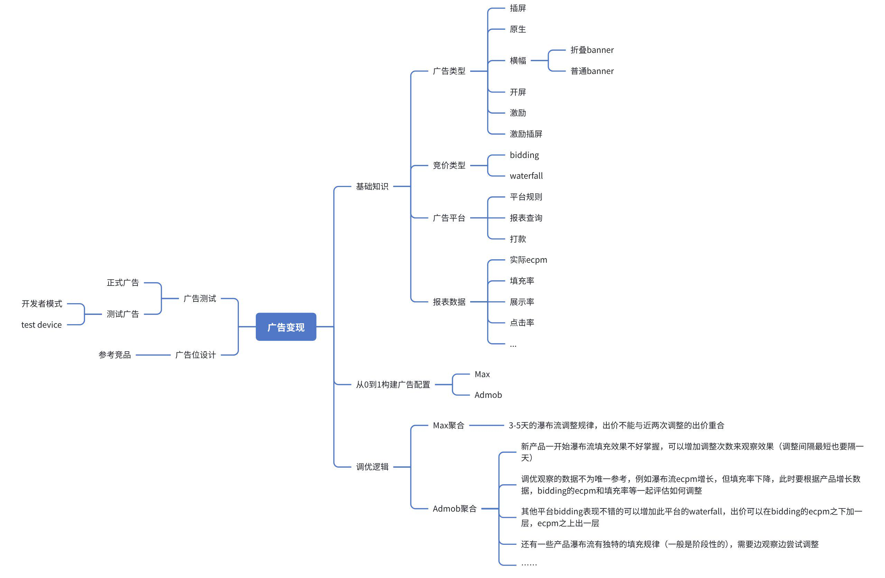

# 变现基础知识库

需要掌握的能力：基础知识、从0到1构建广告配置、调优逻辑、广告测试等

# 基础知识

## “高频”词汇

- **eCPM**：每一千次展示获得的广告收入

- **DAU**：每日活跃用户数

- **DNU**：每日新增用户

- **IPU**：每个活跃用户的广告展示次数

- **ARPDAU**：当日总收入/当日活跃用户数

- **ROI**：投资回报率

- **IAP**：应用内购买

- **CPI**：每次用户安装费用

- **CPA**：行动付费

- **CPC**：每次点击付费广告

- **LTV**：用户终身价值

- **CTR**：点击率

---

## 常用广告平台

- Admob

- Applovin

- Meta（Facebook）

- Vungle（Liftoff）

- Pangle

- Fyber（DT Exchange）

- Inmobi

- Unity

- IronSource

- Chartboost

- Mintegral

- BidMachine（配置时只需要Source ID）

- Moloco

---

## 各类广告格式及规则

- **Intersitial**：全屏展示的广告，支持图片、动态图或视频。

|展示要求|违规雷区|
|---|---|
|- 时机恰当： 在自然的过渡点展示。例如：游戏关卡结束后、图片浏览暂停时、返回主菜单前。 - 关闭按钮清晰： 必须提供一个清晰、易于点击的关闭（X）或跳过按钮。通常建议在广告加载后立即或5秒内出现。 - 预加载机制： 提前加载广告，确保在需要展示时能流畅弹出，而不是让用户等待一个空白的加载页面。|- "开门杀" 或 "临别礼": 应用启动后立即弹出插屏，或用户点击退出应用时弹出。这两种体验极差，是AdMob明令禁止的。 - 干扰核心操作： 在用户正在进行沉浸式体验时（如游戏中途、阅读文章时）突然弹出。 - 连续轰炸： 用户关闭一则插屏后，立即弹出另一则。或者在一个很短的操作路径里（如点击2\-3次）频繁展示。 - 欺骗性关闭按钮： 关闭按钮过小、透明、延迟出现，或者设计成一个假的“下载”按钮，诱导用户点击。 - 用户返回时弹出： 用户点击手机的“返回”键，期望返回上一级菜单，结果却弹出了插屏广告。|

- **Native advanced**：广告素材（标题、图片、描述）与 App 本身的内容样式高度融合，看起来像是应用的一部分。

|展示要求|违规雷区|
|---|---|
|- 必须明确标记： 必须在显著位置包含“广告”、“Ad”、“推广”、“Sponsored”等清晰的标记，让用户一眼就能识别出这是商业推广内容。 - 包含广告元素： 必须包含广告平台SDK要求的一些标准元素，如AdChoices图标。 - 风格协调： 广告的字体、颜色、布局应与周围内容保持一致，以提供无缝的浏览体验。|- 隐藏广告标识： 将“广告”标识做得极小、颜色与背景融为一体，或者根本不加标识，试图让用户以为这是普通内容。 - 模仿应用功能： 广告的点击行为被设计得与应用功能一致，容易让用户混淆。 - 误导性内容： 广告的标题和图片看起来像一条新闻或用户动态，但点击后直接跳转到下载页面，内容与标题严重不符。|

- **Banner**：占据屏幕顶部或底部的一小块长方形区域。

|展示要求|违规雷区|
|---|---|
|- 位置固定： 展示在屏幕顶部或底部，不应遮挡应用的核心交互区域。 - 尺寸标准： 使用平台提供的标准尺寸（如320x50, 300x250等），自适应banner是目前的主流。 - 清晰可辨： 广告内容和边框应与App内容有明显区分。|- 遮挡核心内容： 将Banner广告放置在用户需要交互的按钮、菜单或内容之上。 - 诱导意外点击： 将Banner放置在游戏的操作按钮旁边，或者在一个高速滚动的列表项之间突然加载，导致用户误触。 - 堆叠广告： 在同一屏幕上展示多个Banner广告。 - 伪装成内容： Banner的设计与App内容融为一体，没有清晰的边界，让用户误以为是App的一部分。|

- **App open**：App 启动时展示的全屏广告，通常持续 3\-5 秒。

|展示要求|违规雷区|
|---|---|
|- 在加载/闪屏\(Splash Screen\)期间展示： 这是为这个场景量身定制的广告格式。 - 不要过度延迟： 广告展示不应显著增加应用的加载时间。 - 提供退出路径： 允许用户随时跳过并进入应用主界面。|- 与插屏混用： 如果你已经使用了开屏广告，就不要在应用加载完成后再立即弹一个插屏广告。 - 覆盖在应用内容之上： 当应用的主界面已经加载出来并可交互时，开屏广告还覆盖在上面。|

> 热启动：指用户切出应用，应用保留在后台，用户又切回应用的操作

> 冷启动：指应用在被彻底关闭后，从头开始创建进程并重新加载。

- **Rewarded**：用户主动点击观看一段 15\-30 秒的视频，完成后获得应用内的奖励（如金币、解锁关卡、去广告特权）。

|展示要求|违规雷区|
|---|---|
|- 用户主动触发： 必须由用户点击明确的入口（如“观看视频获取双倍奖励”按钮）来触发，不能自动播放。 - 奖励明确且兑现： 在用户观看前，必须清晰地告知他们将获得的奖励。观看结束后，必须立刻、足额地发放奖励。 - 入口清晰： 广告入口的设计不能有误导性。|- 强制观看： 将激励视频作为继续使用App核心功能的唯一路径 - 奖励欺诈： 承诺的奖励与实际发放的不符，或者干脆不发奖励。 - 诱导点击广告内容： 不能鼓励或奖励用户点击广告内部的链接，只能奖励他们观看完视频的行为。 - 入口伪装： 把激励视频的触发按钮伪装成“下一关”、“继续”等常规功能按钮，导致用户在不想看广告时误触。|

- **Rewarded interstitial**：它不需要用户主动点击“看广告换奖励”的按钮，而是在天然的转场处自动弹出，但给用户一个“看完领奖”或“直接关闭”的选择。

|展示要求|违规雷区|
|---|---|
|- 时机自然是第一要义： 和插屏广告一样，必须在流程的自然停顿点展示。 - 奖励明确且有吸引力 : 弹出的提示框必须一目了然地告诉用户看什么，得什么。 - 选择权必须清晰、平等：“接受”和“拒绝”的按钮必须同样清晰可见，尺寸相当。 - 兑现承诺： 用户看完广告后，必须立即、足额地发放所承诺的奖励，并在UI上给予明确反馈|- 强制或误导性入口：假选择，欺骗性文案或隐藏关闭按钮。 - 破坏核心循环：不能将观看激励插屏作为继续游戏或使用App核心功能的唯一路径。 - “选择跳过”后依然展示广告： 如果用户选择了“不了，谢谢”，就必须立即关闭广告窗口。 - 与其他广告格式无缝衔接/轰炸： 用户刚关闭一个插屏广告，紧接着就弹出一个激励插屏。|

---

## 测试广告

进入开发者模式 : 一般需要密码进入，进入的方式各个应用各不同。

- 添加测试设备：开发者模式→Misc Info→Google Advertising ID

---

## 开发者网站

位置：打开产品的应用商店链接→应用支持→网站

- 查看ads\.txt：在开发者网站后加：/app\-ads\.txt

> Ads\.txt相关介绍：[What is app\-ads\.txt](https://unity.com/cn/blog/what-is-app-ads-txt)

---

## 聚合配置方法

Applovin Max聚合：

1. 新建聚合组ID（同步给产品）

2. 配置Bidding和Admob Waterfall

3. Admob Waterfall可以建A1、A2、A3来兜底

---

Admob 聚合：

1. 新建聚合组的Ad Unit ID（同步给产品）

2. 新建聚合组

3. 配置Bidding和OPMC

- **命名规律**：

    - Ad units

        - Max：*X\-Max\-xx/bidding*

        - Admob：*X\-Admob\-xx/bidding*

    - Mediation group

        - Max：*X\-App Name*

        - Admob：*X\-App Name\-Country/App Name\-X\-Country*

> X为广告格式缩写

---

## 广告竞价流程图

---

# 日常工作

### **数据监测**

1. **各广告平台展示数**

    - **监测内容**：每日查看各平台的广告展示量是否在正常波动范围内，有无异常下跌。

    - **应对措施**：若某一平台展示量突然大幅下降，应立即联系该平台的客户经理，排查是否存在政策限制、技术故障或账户问题。

2. **各广告格式 eCPM 波动**

    - **监测内容**：观察不同广告格式（如激励视频、插屏、横幅等）的 eCPM 是否在正常范围内波动。

    - **异常判断与排查**：若某个格式出现异常下跌，需进入后台分渠道（广告平台）进一步查看以下数据，以定位下跌原因：

        - **eCPM**：是否所有渠道都在下跌，还是个别渠道拉低了整体水平；

        - **填充率**：是否因填充率下降导致竞价不充分，拉低 eCPM；

        - **点击率**：点击率是否异常波动，排查是否存在无效流量或素材问题。

3. **IPU稳定性**

    - **监测内容**：1\. 在没有新增或减少广告场景的前提下，观察 IPU 是否保持稳定，有无异常上涨或下跌。2\. 新包上线之后，产品逐渐优化广告变现的过程要密切关注IPU的数据。

    - **异常判断**：若 IPU 出现大幅波动，且同时伴有DNU（日新增用户）异常增多，需警惕是否存在被盗包（应用被篡改或劫持）的风险，应及时检查包体完整性和渠道来源。

4. **新包上线数据校验**

    - **监测内容**：新版本或新应用上线后，检查所有配置的广告平台是否都有数据回传。

    - **排查方向**：若某个平台无数据，需依次检查：

        - **产品集成**：广告 SDK 是否正确接入并调用；

        - **ads\.txt**：是否配置正确且可被平台抓取；

        - **广告 ID 配置**：如应用 ID、广告位 ID 等是否填写无误。

---

### 新产品配置

1. **Admob**

    1. 在Admob账户中新建App，一般需要审核一段时间才会有正式广告。

    2. 新建广告ID

2. **Facebook**

    1. 在Meta账户中新建App（一般由老板完成）

    2. 新建广告ID

3. **Ads\.txt配置**

4. **UMP**（Admob后台→“**Privacy \&amp; messaging**”→添加产品的**Privacy URL**）

> 统一同意管理 \(CMP\)：面对 GDPR、CCPA 等复杂的国际隐私法规，UMP SDK 为应用开发者提供了一个标准化的 “意见征求管理平台” 。

5. **Firebase**

> Firebase=“辅助分析工具 \+ 消息推送 \+ 远程配置”

6. **聚合配置**

7. **BI后台配置**（广告平台id，开发者网站）

8. **产品隔离**

> 屏蔽相同品类的应用：Admob后台→Blocking controls→App install ads）

---

### 瀑布流优化具体操作

- Admob聚合

1. 登记出价

将调整后的出价记录在调优表格中，以备后续追踪和复盘。

2. 进入对应聚合组

登录 AdMob 后台，进入“Mediation”（聚合）页面，找到以目标国家命名的聚合组并点击进入。

3. 删除原有出价

在聚合组内的“Waterfall”区域，定位并删除之前使用的出价项。

4. 新增广告源

点击“Add ad source”（添加广告源），根据所选广告平台进行以下选择：

◦ AdMob 瀑布流：选择“AdMob Network Waterfall”

◦ Pangle 瀑布流：选择“Pangle”

◦ Vungle 瀑布流：选择“Liftoff Monetize”

◦ Fyber 瀑布流：选择“DT Exchange”

5. 设置 Label（标签）

◦ 若为 AdMob 瀑布流，Label 格式为：OPMC\-xx\(出价\)

示例：OPMC\-1\.5

◦ 若为 其他平台瀑布流，Label 格式统一为：平台名\-xx

示例：Pangle\-1\.2、Liftoff\-0\.8

6. 填入出价

在“Manual eCPM”字段中，输入调整后的出价金额。

7. 关联已有映射

点击“Select a mapping”（选择映射），在过往添加过的出价中找到与该出价匹配的映射项并选中。

8. 完成单个广告源添加

点击“Done”，该出价即添加完成。

9. 保存整体配置

按上述流程依次完成所有需要调整的出价后，点击页面底部的“Save”按钮，本次瀑布流出价调整即保存生效。

---

### 广告调优步骤

**AdMob 聚合瀑布流（Waterfall）出价调优 SOP**

**一、 数据准备与前置指标检查**

在开始调整前，统一拉取数据并明确指标权重：

- 时间范围：近 3 日（含调整当日）。

- 分析对象：指定应用的特定聚合组（Mediation Group）。

- 核心参考指标：AdMob Bidding/Network 的实际 eCPM、填充率（Match Rate）、点击率（CTR）。

- 低权重指标：当日的展示率（Show Rate）。由于数据回传延迟或未跑完，当日展示率极不准确，不占太多参考比重。

---

**二、 调优策略（基于 Bidding 表现）**

根据 AdMob Bidding eCPM 与部分瀑布流填充率的联动效应，分为以下三种常规调整场景：

|场景分类|核心表现|调优动作与逻辑|
|---|---|---|
|情况 A|Bidding eCPM 持续下降 部分瀑布流填充率升高|保守观察：调优不宜过于激进，避免大幅上调瀑布流出价，以防进一步拉低整体收益（ARPU/Revenue）。|
|情况 B|Bidding eCPM 表现稳定 部分瀑布流填充率升高或降低|顺势微调：依据填充率的变化，对瀑布流出价进行相应的上调或下调，核心目的是维持填充率与 eCPM 的动态平衡。|
|情况 C|Bidding eCPM 持续升高 部分瀑布流填充率降低|积极争取：参考当前 Bidding 高企的 eCPM 水平，适当上调瀑布流出价，卡住优质区间，争取更高价值的广告展示。|

---

**三、 边界值与“不调整”熔断机制**

为了避免高频、无效的无效调整，设立以下硬性过滤漏斗：

1. 天花板效应（最高限价）

- 新配Admob瀑布流一般最高出价参考：近几日 AdMob Bidding 实际 eCPM 的 2 倍。

- *特殊情况*：如果出到该价格后依然填充不上，说明该层无量，切勿强行继续抬高。

2. 地平线效应（最低填充标准）

低于以下标准的底价层级，通常认为失去代表性或处于衰退期：

- AdMob 瀑布流：填充率最低标准为 3%。

- 其他三方 Header Bidding / 瀑布流渠道：以收入为衡量标准，填充率最低标准为 1%。

3. “不调整”熔断场景（过滤噪音）

- 低曝光陷阱：AdMob 瀑布流填充率虽然在 5%\~10% 之间，但展示数（Impressions）小于 100。此情况数据纯属随机波动，不做调整。

- 常规微幅震荡：AdMob 瀑布流在 3 日内出现“先涨后跌”，但整体涨跌幅度都在 1% 左右。此情况属于正常数据大盘内波动，不做调整。

---

**四、 异常极端情况排查与归因**

当遇到原本填充率很高，突然在两天内暴跌至 0\.x% 的断崖式下跌时，执行以下双通路排查：

诊断一：买量/用户增长突增

- 现象表现：填充率暴跌，同时伴随着 AdMob Bidding eCPM 的同步上涨。

- 背后逻辑：由于短时间内涌入大量新用户/低价值变现流量，大盘请求量剧增。现有的瀑布流出价对于这批新流量来说偏低，导致卡不上位置。

- 应对措施：根据当前最新的 AdMob Bidding 实际 eCPM 重新计算并上调出价，重新咬合流量。

诊断二：用户流量周期性波动（规律性淡季）

- 现象表现：填充率暴跌，但瀑布流层的实际 eCPM 与填充稳定时基本持平。

- 背后逻辑：属于受假期、周末或产品自身流量周期影响的规律性下降，广告位整体变现价值未发生本质质变。

- 应对措施：无需恐慌，直接根据该层处于稳定时期的填充率，进行常规的上下微调出价即可。

---

### 产品运营

- 每个月3号左右出Admob账户的核减账单，可以在Admob后台的Payment界面查看账户上个月的核减比例，\<10%都为正常范围。

- 定期调整阈值，拉取DAU稳定时期的数据。

- 不同产品产品数据有自身的波动规律，为了调整效果可以在数据变化上升前调整。

- **Max聚合**产品瀑布流波动有规律，但是规律也会有变化，需要按情况调整。

- 至少每周查一次所有的Admob账户是否有政策问题报错和不属于账户内的产品请求**。**

---

### Firebase中配置A/B Test操作

1. 复制需要测试的广告的key

2. A/B Testing 创建实验

3. 远程配置

4. 填写测试名称说明后，选择应用，根据需求选择百分比的用户量测试（量级大的选20%左右即可），激活事件可以不填

5. 目标一般选择“留存”和“广告收入”

6. 复制之前的key，描述写false，提交审核后需要手动选择开启测试

---

Admob账户核减是因为Admob判断账户内应用存在**无效流量**，所以扣除这部分展示带来的收益。

### 无效流量

Invalid Traffic，是指任何非真实用户意图产生的广告点击、展示或转化。这类流量不仅会降低广告主的投放价值，也会伤害开发者的变现健康度。 AdMob 会从账户中扣除无效流量产生的收入，长期甚至可能导致账户限制或封停。

1. **无效流量的主要来源**

|类型|具体表现|产生的根本原因|
|---|---|---|
|重复人工点击|同一用户短时间内大量点击广告（例如连点、故意狂点）|用户故意或无意触发|
|自动点击 / 机器人|使用模拟器、脚本、自动化工具批量产生点击或展示|黑产或恶意竞争者|
|诱导点击|将广告伪装成应用界面必须点击的元素，或遮挡、误触|变现策略不当|
|展示作弊|广告被加载但在屏幕外不可见，或堆叠不可见层|SDK 错误配置或恶意代码|
|非人类流量|爬虫、蜘蛛、模拟浏览器访问广告|搜索引擎、检测工具|
|激励流量滥用|激励视频广告中用户未看完视频即获得奖励，或刷视频|未按 AdMob 政策实现|
|开发者自点击|开发者自己或雇佣他人点击自己的广告|违反政策的故意行为|

---

2. **Google 如何检测无效流量**

AdMob 使用 **实时\+离线** 双重系统监测无效流量：

- 实时（前台）检测

在广告请求、点击、展示发生瞬间，Google 的算法会分析：

- IP 地址、用户代理、设备特征

- 点击/展示的时间模式（例如每秒20次）

- 点击与展示的地理位置是否一致

- 是否与已知机器人特征匹配

- 离线（后台）分析

活动发生几小时或几天后，Google 会运用更复杂的机器学习模型：

- 识别重复交互模式

- 交叉对比多个发布商的数据

- 过滤被判定为无效的流量，并调整收入报告

最终，在每月月底生成的收入报告中，AdMob 会显示 “无效流量扣减” 一栏，直接从预估收入中扣除。

---

3. **如何避免无效流量**

    1. 不要采取任何诱导或伪装点击的设计

        - 广告必须明确标示“广告”或“Ad”字样

        - 不要将广告放在容易误触的位置（例如关闭按钮下方）

        - 激励视频要让用户明确知道“看完整视频才能获得奖励”

    2. 不要在应用内使用刷新或自动加载广告

        - 不要自动刷新横幅广告

        - 不要使用轮播或自动展示超过一个广告单元

    3. 避免在自己的设备上测试或点击广告

        - 开发调试时必须使用测试广告单元（测试广告不会产生无效流量）

        - 不要用自己的真实广告测试点击或展示

    4. 接入 AdMob 提供的工具

        - 开启 *“Blocking controls*” 可以屏蔽特定类别的广告

        - 在 AdMob 后台设置 无效流量提醒，一旦异常立即收到邮件

    5. 定期检查 AdMob 后台的无效流量报告

        - 如果某个广告单元的无效流量异常升高，考虑调整其位置、频次或中介配置

    6. 审计集成第三方 SDK

        - 某些三方聚合 SDK 或流量交换平台可能植入恶意代码刷量，确保只使用正规经过审核的 SDK

---

### 数据分析

如果有事件打点系统，能够基于应用内预先埋设的用户行为打点数据，独立构建并执行自定义查询，高效提取与分析特定业务场景的关键事件指标（例如：特定广告位、特定广告格式的展示/曝光次数 \- Impression Count）。

---

# Tips

- Admob账户中每个App新建广告单元个数每日上限20个。

- Vungle中配置激励插屏时，先新建一个激励视频的bidding广告位，在这个广告位设置中选择可以跳过即可

- CodeX的GPT账户：[timelyidea@gmail\.com](mailto:timelyidea@gmail.com) 密码：3Xh2x@N\.poWWz\*mEfL\*b

---

# 产品上线

- BASE64\_PLAY\_API\_PUBLIC\_KEY位置

- google\-services\.json位置

---

2. **日常上包流程**

- iOS

    - 下载文件夹→解压 （用Transport打开压缩包）

    - App Content→App→Test Fight（看到新版本后）→跳出弹窗，选择不属于任意一种→default群组
    “用户和访问”可以增加测试机，添加Apple ID（邮箱）

    - 分发（上架） 点击“iOS App”旁边“\+”→构建版本（填写版本号，选择上传的包）→新版本文字描述：fix some bugs→添加以供审核（点2次）

    - 等待过审邮件，收到邮件后再手动发布（点击发布）

- Android

    - 复制打包好的压缩包文件到虚拟机桌面中对应产品的文件夹内，用7zip解压

    - GP后台“Test\&Release”→Opening Test→Creat new Release→Upload 选择新版本的abb文件上传→Release Note 复制之前版本即可 （开放测试 100%发布）（halt rollout：撤回版本）

    - Production（正式发布）→Creat new Release→在Library中选择新版本→选择发布的百分比（一般量级大的从20%开始）

    - Publish Overview 可以看到所有的改动 提交审核

---

3. **后台评论\&邮箱**

可以利用Codex回复，参考先前的回复格式即可。对要求退订的用户：问询使用中遇到什么问题（等类似回答）。使用不了，连接不上等情况：问询使用的电视品牌，手机型号，希望可以具体描述他们的操作流程（等类似回答）。

> Android—— Google Play Console: “Monitor”→“Ratings and Reviews”→“Reviews”

